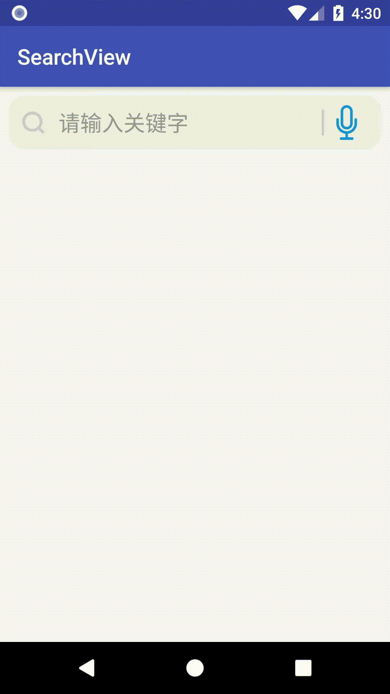

# SearchView--自定义搜索框

[](https://jitpack.io/#12313kaihuang/SearchView)
### 效果图：    
         

  
### 使用：  
1. 在项目根目录的`build.gradle`中添加一句`maven { url 'https://jitpack.io' }`
```xml
allprojects {
    repositories {
        ...
        maven { url 'https://jitpack.io' }
    }
}
```  
2. 在**app**的`build.gradle`中添加依赖：
```xml
dependencies {
    ...
    implementation 'com.github.12313kaihuang:SearchView:2.3'
}
```
 
 ### 属性&方法  
| 名称 | 类型 | 作用 |
| ------ | ------ | ------ |
| hint | 属性 | 输入框的`hint`属性 |
| svSearchIcon | 属性 | 搜索图标 |
| svClearIcon | 属性 | 清空图标 |
| svVoiceIcon | 属性 | 语音图标 |
| svEnableAutoHideSoftKey | 属性 | 点击搜索后是否自动隐藏虚拟键盘 |
| svEnableClearFocusAfterSearch | 属性 | 点击清除按钮后是否自动清除EditText的焦点 |
| setSearchIcon | 方法 | 设置搜索图标 |
| setClearIcon | 方法 | 设置清除图标 |
| setVoiceIcon | 方法 | 设置语音图标 |
| setEnableAutoHideSoftKey | 方法 | 设置点击搜索后是否自动隐藏虚拟键盘 |
| setEnableClearFocusAfterSearch | 方法 | 设置点击清除按钮后是否取消EditText的焦点 |
| getEditText | 方法 | 获取输入框`EditText` |
| getSearchContent | 方法 | 获取输入框`EditText`内容 |
| setSearchContent | 方法 | 设置输入框`EditText`内容 |
| setOnVoiceImageButtonClickListener | 方法 | 语音按钮点击事件 |
| setOnVoiceImageButtonClickListener | 方法 | 搜索图标点击事件 |
| setOnClearImageButtonClickListener | 方法 | 清除按钮点击事件 |
| setOnSearchTextViewClickListener | 方法 | 搜索的点击事件 |

**[说明]**  
`ClearEditText`相当于是从`SearchView`中抽出来的一个带有清除按钮的输入框，其清除图标需通过`drawableEnd`或`drawableRight`设置。  

### 示例：
* 布局`xml`文件中使用:
```xml
 <!-- 下面示例中的值等于默认值 -->
 <com.searchview.SearchView
    android:id="@+id/searchView"
    android:layout_width="match_parent"
    android:layout_height="50dp"
                            
    app:hint="请输入关键字"
    app:svSearchIcon="@drawable/sv_ic_search"
    app:svVoiceIcon="@drawable/sv_ic_voice_icon"
    app:svClearIcon="@drawable/sv_ic_clear"
    app:svEnableAutoHideSoftKey="true"
    app:svEnableClearFocusAfterSearch="true"/>
```
* `java`文件中：
```java
public class SearchViewActivity extends AppCompatActivity {

    @Override
    protected void onCreate(Bundle savedInstanceState) {
        super.onCreate(savedInstanceState);
        setContentView(R.layout.activity_main_search_view);

        SearchView searchView = findViewById(R.id.searchView);

        //下面示例中的值等于默认值
        searchView.setEnableAutoHideSoftKey(true);  //设置点击搜索后是否自动隐藏虚拟键盘
        searchView.setEnableClearFocusAfterSearch(true); //设置点击清除按钮后是否取消EditText的焦点

        searchView.setSearchIcon(R.drawable.sv_ic_search); //设置搜索图标
        searchView.setVoiceIcon(R.drawable.sv_ic_voice_icon); //设置语音图标
        searchView.setClearIcon(R.drawable.sv_ic_clear); //设置清除图标

        //设置搜索图标点击事件
        searchView.setOnSearchImageViewClickListener(new ISearcher.OnImageViewClickListener() {
            @Override
            public void onImageViewClick(EditText input, ImageView imageView, View view) {
                Toast.makeText(SearchViewActivity.this,"点击了搜索图标",Toast.LENGTH_SHORT).show();
            }
        });

        //设置语音图标点击事件
        searchView.setOnVoiceImageButtonClickListener(new ISearcher.OnImageButtonClickListener() {
            @Override
            public void onImageButtonClick(EditText input, ImageButton imageButton, View view) {
                Toast.makeText(SearchViewActivity.this,"点击了语音图标",Toast.LENGTH_SHORT).show();
            }
        });

        //设置清除图标点击事件
        searchView.setOnClearImageButtonClickListener(new ISearcher.OnImageButtonClickListener() {
            @Override
            public void onImageButtonClick(EditText input, ImageButton imageButton, View view) {
                Toast.makeText(SearchViewActivity.this,"点击了清除图标",Toast.LENGTH_SHORT).show();
            }
        });

        //设置“搜索”点击事件
        searchView.setOnSearchTextViewClickListener(new ISearcher.OnSearchTextViewClickListener() {
            @Override
            public void onSearchClick(EditText input, View view) {
                Toast.makeText(SearchViewActivity.this,"点击了搜索",Toast.LENGTH_SHORT).show();
            }
        });
    }
}
```


 
